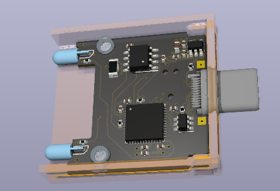
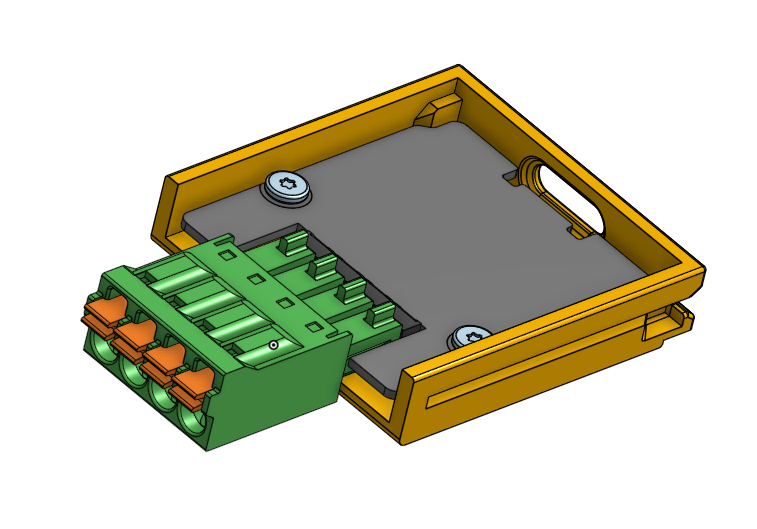

# framework CAN Interface

USB to CAN device that fits in a Framework laptop expansion card.

## Hardware

The USB to CAN device is based on the _STM32G431_ microcontroller and _TCAN1042_ CAN transceiver.

The hardware is inspired by (but not a direct clone of) the [Canable 2.0](https://canable.io/).

It includes a removeable push-in spring connector for easy wiring to any CAN bus.

## Software support

Supports CANFD (Up to 5Mbaud) with _slcan_ firmware, and socketcan on Linux with _candlelight_ firmware.

For software support, see the "_Software Support_" section at [canable.io](https://canable.io/)
